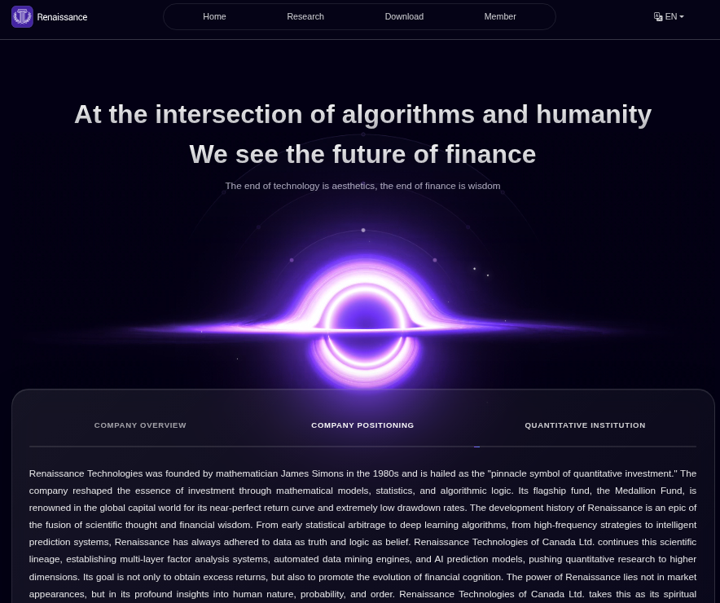

# Renaissance WordPress Theme

**一款专为量化投资和金融科技企业打造的专业 WordPress 主题**

---

## 📋 目录

- [简介](#简介)
- [系统要求](#系统要求)
- [安装指南](#安装指南)
- [核心功能](#核心功能)
- [快速开始](#快速开始)
- [文档](#文档)
- [自定义文章类型](#自定义文章类型)
- [多语言支持](#多语言支持)
- [常见问题](#常见问题)
- [更新日志](#更新日志)
- [技术支持](#技术支持)

---

## 🌟 简介

Renaissance 是一款专为量化投资和金融科技企业打造的专业 WordPress 主题。主题采用深色科技风格设计，内置完整的多语言支持系统，完美集成 Elementor 页面构建器和 Polylang 多语言插件。

### 主要特点

- ✨ **现代化设计** - 深色科技风格，响应式布局，完美适配各种设备
- 🌍 **多语言支持** - 内置中文、英文、法语支持，基于 Polylang 插件
- 🎨 **Elementor 集成** - 完美支持 Elementor 页面构建器，15+ 自定义小部件
- 📊 **自定义内容类型** - 科学家团队、案例研究、公告系统、视频教程等
- 👥 **会员系统** - 内置会员权限管理，支持下载权限控制
- 🔒 **安全可靠** - 符合 WordPress 安全标准，定期更新维护

---

## 💻 系统要求

### 最低要求

- **WordPress**: 6.0 或更高版本
- **PHP**: 7.4 或更高版本
- **MySQL**: 5.6 或更高版本（推荐 5.7+）

### 推荐配置

- **WordPress**: 6.4+
- **PHP**: 8.0+（推荐 8.1+）
- **MySQL**: 5.7+ 或 MariaDB 10.3+

### 必需插件

- [Polylang](https://wordpress.org/plugins/polylang/) - 多语言支持（免费版或专业版）
- [Elementor](https://wordpress.org/plugins/elementor/) - 页面构建器（免费版或专业版）

### 可选插件

- [Advanced Custom Fields (ACF)](https://www.advancedcustomfields.com/) - 自定义字段管理（推荐）
- [Contact Form 7](https://wordpress.org/plugins/contact-form-7/) - 联系表单

---

## 🚀 安装指南

> ⚠️ **重要提示**: 为了确保主题安装后演示内容完整，**强烈建议先安装并激活 Polylang 插件**，然后再安装并启用本主题。如果先安装主题再安装 Polylang，可能会导致初始演示内容不完整。

### 方法一：通过 WordPress 后台安装

1. **安装 Polylang 插件**（推荐先执行此步骤）
   - 进入 **插件 > 安装插件**
   - 搜索并安装 **Polylang** 插件
   - 激活插件并完成基本配置

2. **安装主题**
   - 进入 **外观 > 主题 > 添加新主题**
   - 点击 **上传主题**
   - 选择 `renaissance.zip` 文件
   - 点击 **现在安装**
   - 安装完成后，点击 **启用**

### 方法二：通过 FTP 上传

1. **安装 Polylang 插件**（推荐先执行此步骤）
   - 通过 WordPress 后台或 FTP 安装 Polylang 插件
   - 激活插件并完成基本配置

2. **上传主题**
   - 解压主题文件到本地
   - 将 `renaissance` 文件夹上传到 `/wp-content/themes/` 目录
   - 登录 WordPress 后台
   - 进入 **外观 > 主题**
   - 找到 Renaissance 主题并点击 **启用**

### 安装后配置

1. **安装必需插件**
   - 安装并激活 Polylang 插件（如果尚未安装）
   - 安装并激活 Elementor 插件

2. **配置多语言**
   - 进入 **语言 > 语言** 设置语言
   - 推荐配置：中文、英文、法语
   - 主题会自动为每种语言创建页面和菜单

3. **检查自动创建的内容**
   - **页面**: 主题会自动创建所有必要页面（Home、Research、Downloads、Contact 等）
   - **菜单**: 主题会自动创建 Primary Navigation 和 Footer Navigation 菜单
   - **演示内容**: 主题会自动创建案例、公告、视频、科学家等演示内容
   - 所有页面已标记为支持 Elementor 编辑器（登录、注册、忘记密码页面除外）

4. **刷新固定链接**
   - 主题会自动设置固定链接为"文章名"格式
   - 如需要，可进入 **设置 > 固定链接** 检查

5. **开始编辑**
   - 进入 **页面 > 所有页面** 开始编辑页面
   - 进入 **外观 > 菜单** 管理菜单
   - 进入对应的内容类型管理演示内容

---

## ⚡ 核心功能

### 1. 多语言支持

- **支持语言**: 中文、英文、法语
- **URL 结构**: 自动生成多语言 URL（如 `/en/`, `/zh/`, `/fr/`）
- **内容翻译**: 基于 Polylang 的内容翻译系统
- **菜单翻译**: 自动多语言菜单管理
- **字符串翻译**: 支持 Polylang 字符串翻译功能

### 2. Elementor 集成

主题包含 **15+ 自定义 Elementor 小部件**：

- **Hero Section** - 英雄横幅区域
- **Section Title** - 区块标题
- **Feature Cards** - 功能卡片网格
- **Cases List** - 案例列表
- **Announcements List** - 公告列表
- **Scientists List** - 科学家团队展示（滚动动画）
- **Video Tutorials** - 视频教程列表
- **Media Reports** - 媒体报道轮播
- **Downloads Hero** - 下载页面横幅
- **Research Hero** - 研究页面横幅
- **Commercialization Path** - 商业化路径展示
- **Mission Vision** - 使命愿景区块
- **Company Tabs** - 公司信息标签页
- **Get Started CTA** - 行动号召按钮
- **Main Download Card** - 主要下载卡片

### 3. 自定义文章类型

- **Cases（案例）** - 项目案例展示
- **Announcements（公告）** - 公司公告和新闻
- **Videos（视频）** - 视频教程和演示
- **Scientists（科学家）** - 团队成员介绍

### 4. 页面模板

- **登录页面** (`page-login.php`)
- **注册页面** (`page-register.php`)
- **忘记密码页面** (`page-forgot-password.php`)
- **用户资料页面** (`page-profile.php`)
- **联系页面** (`page-contact.php`)
- **下载页面** (`page-downloads.php`)
- **研究页面** (`page-research.php`)
- **投资者关系页面** (`page-investor-relations.php`)
- **隐私政策页面** (`page-privacy-policy.php`)
- **风险警告页面** (`page-risk-warning.php`)

### 5. 会员系统

- **会员注册** - 自定义注册表单
- **权限管理** - 基于角色的内容访问控制
- **下载权限** - 特定内容的下载权限控制
- **用户资料** - 自定义用户资料页面

### 6. 后台增强功能

- **拖拽排序** - 所有文章类型支持拖拽排序
- **多语言筛选** - 后台列表语言筛选
- **快速编辑** - 多语言内容快速编辑链接
- **头像显示** - 科学家列表头像预览

### 7. 维护工具

- **数据清空工具** - 内置一键清空演示数据功能
  - 访问路径: `你的域名/wp-content/themes/renaissance/cleanup-helper.php`
  - 功能说明: 用于清空主题安装时创建的默认演示内容
  - 使用场景: 重新开始搭建网站时，快速清理测试数据
  - ⚠️ **警告**: 此操作不可逆，请谨慎使用！建议在使用前备份网站数据

---

## 🎯 快速开始

> 💡 **提示**: 主题激活后会自动创建所有必要的页面和多语言菜单，这些页面已标记为支持 Elementor 编辑器。您可以直接编辑这些页面和菜单，无需手动创建。

### 1. 编辑首页

主题激活后会自动创建 **Home** 页面并设置为首页。该页面已标记为支持 Elementor 编辑器：

1. 进入 **页面 > 所有页面**
2. 找到 **Home** 页面（或对应语言的首页）
3. 点击 **使用 Elementor 编辑** 或 **编辑**
4. 使用 Elementor 编辑器自定义首页内容
5. 推荐使用主题提供的自定义小部件构建页面

### 2. 配置菜单

主题激活后会自动创建 **Primary Navigation**（主导航）和 **Footer Navigation**（页脚菜单）：

1. 进入 **外观 > 菜单**
2. 可以看到已创建的菜单和菜单项
3. 根据需要添加、删除或重新排序菜单项

> 💡 **提示**: 如果安装主题后网站导航菜单显示异常，请进入 **外观 > 菜单 > 管理位置**，手动将创建的菜单分配到对应的菜单位置（通常是"主导航"和"页脚菜单"）。

4. 查看 [菜单设置指南](docs/MENU-SETUP-GUIDE.md) 了解更多

### 3. 编辑和添加内容

主题激活后会自动创建演示内容（案例、公告、视频、科学家等），您可以直接编辑或添加新内容：

1. **编辑现有案例**: 进入 **案例 > 所有案例**，编辑演示案例或添加新案例
2. **编辑现有公告**: 进入 **公告 > 所有公告**，编辑演示公告或添加新公告
3. **添加科学家**: 进入 **科学家 > 添加新科学家**
4. **添加视频**: 进入 **视频 > 添加新视频**

### 4. 编辑其他页面

所有必要的页面都已自动创建并标记为支持 Elementor 编辑器：

- **Research** - 研究页面
- **Downloads** - 下载页面
- **Contact** - 联系页面
- **Investor Relations** - 投资者关系页面
- **Login** - 登录页面（不支持 Elementor）
- **Register** - 注册页面（不支持 Elementor）
- **Forgot Password** - 忘记密码页面（不支持 Elementor）
- **Privacy Policy** - 隐私政策页面
- **Risk Warning** - 风险警告页面

进入 **页面 > 所有页面**，找到对应页面进行编辑即可。

### 5. 设置页脚

1. 进入 **外观 > 自定义 > 页脚设置**
2. 配置页脚内容和多语言文本
3. 或编辑 **Footer Navigation** 菜单来自定义页脚链接
4. 查看 [页脚多语言指南](docs/FOOTER-MULTILINGUAL-GUIDE.md) 了解更多

---

## 📚 文档

完整的主题文档位于 `docs/` 目录：

### 核心文档

- [自定义文章类型说明](docs/CUSTOM-POST-TYPES.md) - 了解所有自定义文章类型
- [Elementor 小部件指南](docs/ELEMENTOR-WIDGETS-GUIDE.md) - 使用自定义小部件
- [菜单设置指南](docs/MENU-SETUP-GUIDE.md) - 配置多语言菜单

### 配置指南

- [ACF 设置指南](docs/ACF-SETUP-GUIDE.md) - Advanced Custom Fields 配置
- [ACF 免费版指南](docs/ACF-FREE-VERSION-GUIDE.md) - 使用免费版 ACF
- [权限控制指南](docs/PERMISSION-CONTROL-GUIDE.md) - 会员权限管理
- [科学家 CPT 指南](docs/SCIENTIST-CPT-GUIDE.md) - 科学家内容类型使用

### 多语言文档

- [页脚多语言指南](docs/FOOTER-MULTILINGUAL-GUIDE.md) - 页脚翻译配置
- [翻译创建指南](docs/CREATE-REMAINING-TRANSLATIONS.md) - 创建新翻译

### 更新日志

- [更新日志 v1.4.0](docs/CHANGELOG-v1.4.0.md)
- [迁移摘要 v1.4.0](docs/MIGRATION-SUMMARY-v1.4.0.md)
- [新功能说明](docs/WHATS-NEW.md)

### 热修复记录

- [HOTFIX v1.4.1](docs/HOTFIX-v1.4.1.md)
- [HOTFIX v1.4.2](docs/HOTFIX-v1.4.2.md)
- [HOTFIX v1.4.3](docs/HOTFIX-v1.4.3.md)
- [HOTFIX v1.4.4](docs/HOTFIX-v1.4.4.md)

---

## 📝 自定义文章类型

### Cases（案例）

用于展示项目案例和成功案例。

**URL 结构**: `/cases/case-name/`

**支持的功能**:
- 标题、编辑器、特色图片、摘要
- 自定义字段（案例分类、指标、周期等）
- 标签分类

### Announcements（公告）

用于发布公司公告和重要新闻。

**URL 结构**: `/announcements/announcement-name/`

**支持的功能**:
- 标题、编辑器、特色图片、摘要
- 标签分类（如"重要更新"）
- 日期显示

### Videos（视频）

用于展示视频教程和演示视频。

**URL 结构**: `/videos/video-name/`

**支持的功能**:
- 标题、编辑器、特色图片、摘要
- 视频 URL 字段
- 标签分类

### Scientists（科学家）

用于展示团队成员和科学家信息。

**URL 结构**: `/scientist/scientist-name/`

**支持的功能**:
- 标题、编辑器、特色图片
- 页面属性（排序）
- 滚动展示动画

---

## 🌐 多语言支持

### 配置语言

1. 安装并激活 **Polylang** 插件
2. 进入 **语言 > 语言**
3. 添加需要的语言（中文、英文、法语）
4. 设置默认语言

### 翻译内容

1. **翻译页面和文章**:
   - 编辑内容时，使用 Polylang 语言面板
   - 点击语言标志创建翻译

2. **翻译菜单**:
   - 进入 **外观 > 菜单**
   - 为每种语言创建对应菜单

3. **翻译字符串**:
   - 进入 **语言 > 字符串翻译**
   - 翻译主题中的固定文本

### URL 结构

主题支持以下 URL 结构：

- **子目录模式**: `/en/page-name/`, `/zh/page-name/`, `/fr/page-name/`
- **域名模式**: `en.example.com`, `zh.example.com`, `fr.example.com`

---

## ❓ 常见问题

### 1. 主题激活后显示空白页面？

- 检查 PHP 版本是否满足要求（7.4+）
- 检查 WordPress 版本是否满足要求（6.0+）
- 查看服务器错误日志

### 2. Elementor 小部件不显示？

- 确保 Elementor 插件已安装并激活
- 清除缓存（浏览器缓存和 WordPress 缓存）
- 检查 Elementor 版本兼容性

### 3. 多语言不工作？

- 确保 Polylang 插件已安装并激活
- 检查语言是否已正确配置
- 查看 Polylang 设置中的 URL 结构配置

### 4. 固定链接不工作？

- 主题会自动设置固定链接为"文章名"格式
- 如仍有问题，进入 **设置 > 固定链接** 手动保存
- 确保服务器支持 `.htaccess` 文件

### 5. 如何更改主题颜色？

- 使用 Elementor 的全局颜色设置
- 或编辑 `assets/css/style.css` 文件
- 推荐使用子主题进行自定义

### 6. 导航菜单显示异常？

- 进入 **外观 > 菜单 > 管理位置**
- 将创建的菜单手动分配到对应的菜单位置（如"主导航"、"页脚菜单"）
- 确保每种语言都有对应的菜单已分配

### 7. 如何清空演示数据？

主题提供了内置的数据清空工具：

- 访问: `你的域名/wp-content/themes/renaissance/cleanup-helper.php`
- 此工具会清空主题安装时创建的默认演示内容
- ⚠️ **重要**: 此操作不可逆，使用前请务必备份网站数据

---

## 📋 更新日志

### Version 1.6.9

- ✨ 新增拖拽排序功能（所有文章类型）
- 🔧 修复固定链接自动设置
- 📚 整理文档结构
- 🐛 修复多项已知问题

### Version 1.4.4

- 🔧 修复多语言相关问题
- ✨ 优化后台管理界面
- 📝 完善文档

查看 [完整更新日志](docs/CHANGELOG-v1.4.0.md) 了解所有版本更新。

---

## 🛠️ 技术支持

### 获取帮助

- **文档**: 查看 `docs/` 目录下的详细文档
- **问题反馈**: 通过主题作者网站联系
- **Bug 报告**: 请提供详细的错误信息和复现步骤

### 主题信息

- **主题名称**: Renaissance
- **版本**: 1.6.9
- **作者**: JiuLingYun
- **网站**: https://www.jiulingyun.cn
- **授权**: GPL v2 or later

---

## 📄 许可证与版权

### 许可证

本主题基于 [GNU General Public License v2.0](http://www.gnu.org/licenses/gpl-2.0.html) 或更高版本授权。

### 版权信息

**Renaissance WordPress Theme**
- **Copyright © 2025 JiuLingYun**
- **开发者**: JiuLingYun
- **网站**: https://www.jiulingyun.cn
- **许可证**: GPL v2 or later

### 版权声明

本主题由 **JiuLingYun** 原创开发。虽然本主题使用 GPL v2 许可证，允许自由使用、修改和分发，但我们**强烈建议**您：

✅ **保留原始版权声明**  
✅ **在分发时注明原作者**  
✅ **链接回原始主题页面**  

这些是道德层面的请求，而非法律要求，但有助于支持开源开发和社区贡献。

### 使用权利

在 GPL v2 许可证下，您可以：

- ✅ 免费用于个人或商业项目
- ✅ 修改代码以满足您的需求
- ✅ 分发原始版本或修改版本
- ✅ 为分发或支持服务收费

### 使用义务

当您分发本主题（原始或修改版本）时，必须：

- ✅ 保留原始版权声明
- ✅ 包含 GPL 许可证文件
- ✅ 提供源代码
- ✅ 使用 GPL v2 或更高版本

### 支持原作者

如果您觉得本主题有用，欢迎：

- ⭐ 在 GitHub 上给项目点星
- 🐛 报告问题和 Bug
- 💡 建议新功能
- 🔄 贡献代码改进
- 📢 分享给其他用户

### 商业支持

如需商业支持、定制开发或授权咨询，请联系：

- **网站**: https://www.jiulingyun.cn
- **联系**: https://www.jiulingyun.cn/contact

---

## 🙏 致谢

感谢以下开源项目：

- [WordPress](https://wordpress.org/) - 内容管理系统
- [Bootstrap](https://getbootstrap.com/) - CSS 框架
- [Elementor](https://elementor.com/) - 页面构建器
- [Polylang](https://polylang.pro/) - 多语言插件

---

**Made with ❤️ by JiuLingYun**

[官网](https://www.jiulingyun.cn) | [文档](docs/) | [支持](https://www.jiulingyun.cn)

